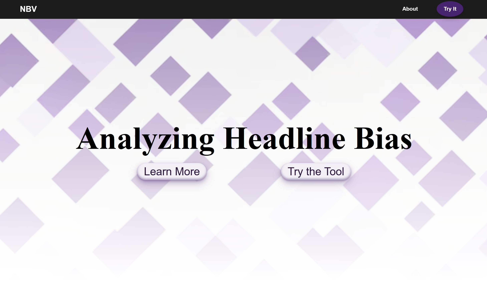
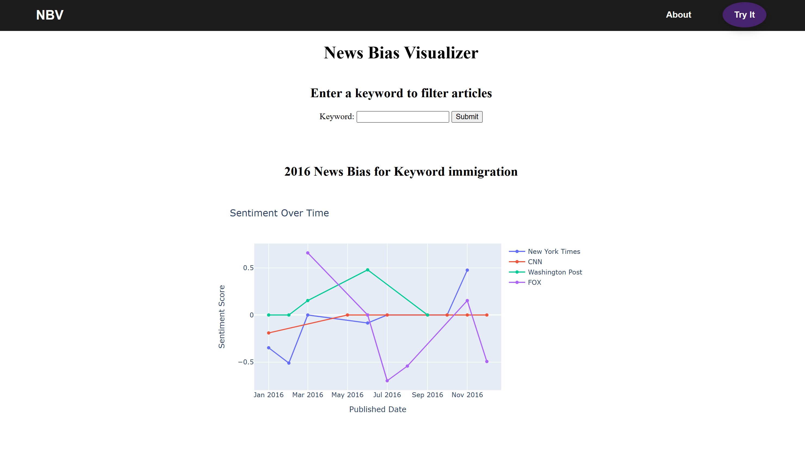
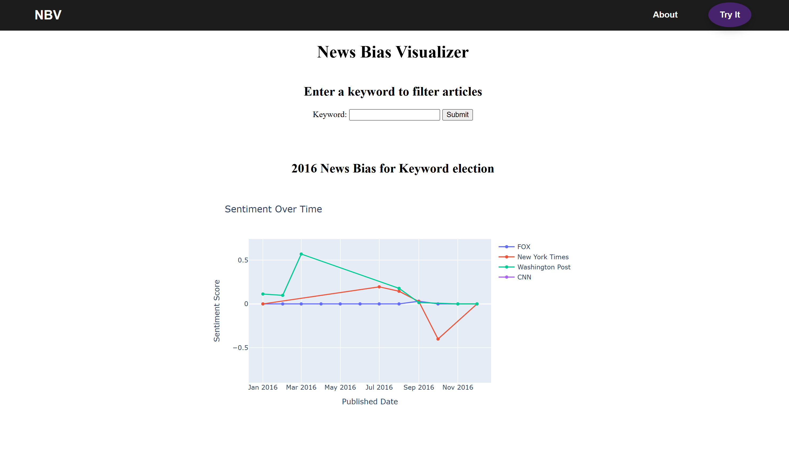

# News Bias 







## How It's Made:

**Tech used:** Python, SQLite3, HTML, CSS

This personal project was developed during my moments of free time in August 2025. It was inspired by some of my classmates' final projects in my Spring 2025 "Natural Language Processing - Advanced Python" course at Georgetown University. My goal was to combine back-end skills (python and sqlite) with front-end design features (html, css) to produce a project with real-world importance.

### What does the tool accomplish?
The aim of the News Bias Visualizer (NBV) is to display bias differences across different mainstream U.S. news sources.

When the user inputs a keyword, the NBV finds all news articles published in 2016 containing that keyword, calculates their sentiment towards said word, and plots these scores on the graph. The result is a graph displaying the degree of bias by each news source towards that word.

### Chosen limitations
Timeframe (2016): I quickly discovered that pulling articles from multiple years would require further optimizations for runtime, and pulling recent articles would require an API key (which I am sadly unwilling to pay for for a small-scale project). I chose 2016 because it was an impactful year in US politics and I theorized a greater display of news bias (cooler results). If I continued working on this proejct, I would increase the timeframe and work on optimizing runtime!

Location (USA): Simply put, I am American and I figure most users of this tool will be Americans. Adding sources from other countries and languages may be a place for later improvement.

Sources (New York Times, CNN, Fox, Washington Post): I chose mainstream, popular U.S. news sources that are left, right, and center-leaning.

### What is the sentiment score?
The NBV tool scores each word in relation to its context. It does so using NLTK SentimentIntensityAnalyzer.
Scores range from -1 to 1, where 1 is extreme positive sentiment, -1 is extreme negative, and 0 is neutral.

## Optimizations
To improve runtime efficiency, sentiment hash locally s results for keywords on first search. Upon re-searching a keyword, the application reuses the previously-calculated data from the hash.


## Usage
1. **Download data**  
   - Manually place the data file into the `data/` folder.  

2. **Run the application**
    - The application will deploy on a local server. Run app.py.
   ```bash
   python app.py
3. View the application on your local server (typically http://127.0.0.1:5000/)